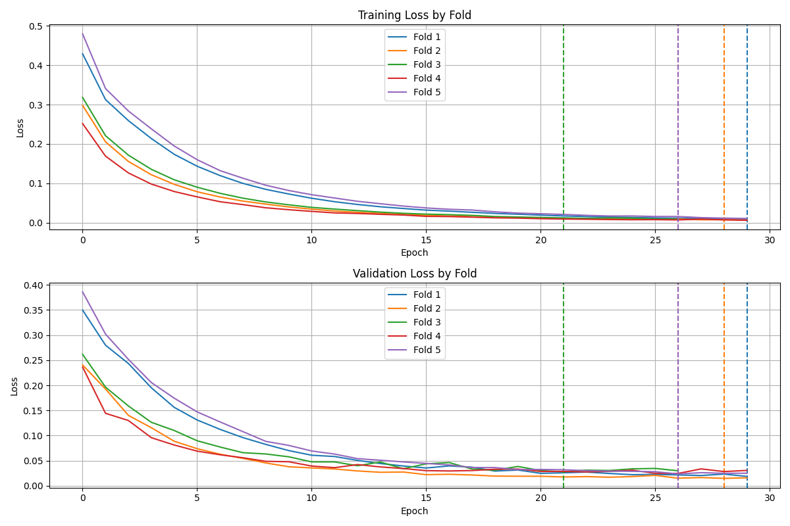

# Task 
```

The green outline is the prostate gland segmentation label, that your model will be trained to predict.

You can use any resource available at your disposal to solve the problem (including publicly available models and codes, use of LLMs, etc.). You are expected to show a complete pipeline including preprocessing steps, training, validation, and evaluation. 

I would like to assess the following:

1. How you approach the problem and justification for each function/module in your code (even if you use publicly available code or LLMs, you are expected to explain what they do)

2. Ability to train the model and show training and validation loss curves

3. Ability to produce results on a sample test set and show both quantitative and qualitative evaluation results for the model. Your model does not need to outperform existing methods, just some standard results and an ability to justify
the results are OK.

4. Clean code and go over code and each functionality during our 1-1 chat
regarding this round of the interview.

```

# Method
1. Perform a brief literature review to establish approaches in the field
https://pmc.ncbi.nlm.nih.gov/articles/PMC8870978/#ref-list1
https://simpleitk.readthedocs.io/en/v1.2.4/Documentation/docs/source/fundamentalConcepts.html#resampling
Documentation for simpleITK and the simpleITK jupyter notebooks were helpful for later coding parts

2. Exploratory analysis with coding, working with 3D slicer, and working with simpleITK 
3. Implementing a simple UNET for results

Architecture I used for this project was a [UNET](https://paperswithcode.com/method/u-net) model. Coded in pytorch with python version 3.9.21. environment.yml file for the anaconda environment is provided in the repository. 

## Data Wrangling
The `prepare_data.py` script was used to unzip the data package and convert it into a folders that were representative of the original datasets

The `exploration.ipynb` file  was used for testing the model, as well as creating data structures to store the data. 

Each MRI-mask pair is treated as a `MedicalImage` object which has attributes to store the original image, the mask, the id of the image, and the generated mask. Methods include an easy way to save to nifti using the SimpleITK packages for viewing in 3D Image slicer. Also includes a method to calculate the Dice coefficient between the mask and generated mask. 

The `SliceDataset` class take  in a list of `MedicalImage` objects to and is used for training. The reason for having two objects is to make individual evaluation for a particular MRI-mask pair or `MedicalImage` object easier in a JupyterNotebook environment, and more intuitive. These classes are stored in the `data_structures.py` file. 
## Preprocessing
I use two main preprocessing steps. One is to resample the image to a 256, 256 image size. This was chosen based on other papers. The code for this part was sampled from the  [UNET](https://paperswithcode.com/method/u-net) paper. I used min-max normalization to standardize intensities between 0,1. 

## Training and hyperparameter tuning
A Grid search was performed to find hyperparameters, optimizing for resample target size, the batch size, and the learning rates. 

5 fold cross validation was used for robustness. 

The model with the best validation loss was chosen, and the final parameters were 

`lr = 1e-5, batch size = 16, target_sampling = 256`

Training was done on the BIDMC, BMC, HK, I2CVB, and RUNMC datasets. The UCL dataset was used for testing. 73 cases were used for training + validation. Of these 58 were used for training and 15 for validation.  13 were used for testing.

## Model Architecture
The [UNET](https://paperswithcode.com/method/u-net) model was used in this case. Code was adopted from the linked paper, and also by using Claude and GitHub Copilot. 

## Results
The results of the Training Loss and testing loss as provided below. In this case, the parameters which yielded the best results for each fold were plotted. 
<div align = "center">

</div>
For Metrics I used common ones mention in imaging papers, namely the DICE score
$$
DICE = \frac{2 |A \cap B|}{|A| + |B|} 
$$
Where the numerator is 2 times the number of overlapping pixels, over the total number of pixels. A DICE score of 1 indicates a perfect overlap. 

The Intersection over union which is given by 
$$
IOU = \frac{\text{TP}}{\text{TP + FP + FN}}
$$
And the sensitivity which is given by 
$$
S = \frac{\text{TP}}{\text{TP + FN}}
$$
These results are summarized in the `evaluation_results.csv`file. The generated masks and the resampled input images are exported as .nii files so it can be visualized in 3D image slice. 
./mo.pth).pth)# prostate-segmentation-task
Repository to store code for segmenting prostate tumors from MRI images for the Bhattacharya lab. 
./mo.pth)